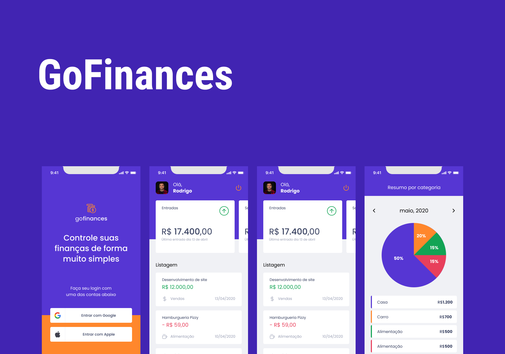

<p align="center">
  

  
 
  <a href="https://github.com/bfukumori/gofinances/commits/master">
    
  </a>
    
   
   <a href="https://github.com/bfukumori/gofinances/stargazers">
    
  </a>

  <a href="">
    
  </a>
</p>

<h1 align="center">
	Gofinances
</h1>

<p align="center">
  <a href="#about">About</a> •
  <a href="#features">Features</a> •
  <a href="#how-it-works">How it works</a> • 
  <a href="#tech-stack">Tech Stack</a> • 
  <a href="#author">Author</a> • 
  <a href="#user-content-license">License</a>
</p>

<div align="center"> 
	
</div>

## About

💲 gofinances - Finances app for managing your precious money.


---

## Features

- [x] Register transactions (income/outcome)
- [x] Social authentication
- [x] Expenses resume chart
- [x] Bottom tab navigation
- [x] Dashboard with list of transactions
- [x] Persist data in asyncStorage

---

## How it works

### Pre-requisites

Before you begin, you will need to have the following tools installed on your machine:
[Git](https://git-scm.com), [Node.js](https://nodejs.org/en/)
In addition, it is good to have an editor to work with the code like [VSCode](https://code.visualstudio.com/) and Expo Go app installed in your phone.

#### Running the application (mobile)

```bash

# Clone this repository
$ git clone git@github.com:bfukumori/gofinances.git

# Access the project folder in your terminal
$ cd gofinances

# Install the dependencies
$ npm install

# Run the application in development mode
$ npm run start

# The app will create a QR code that you can read in Expo Go app to run in your mobile device.
# If you prefer, you can use an emulator. More info: https://react-native.rocketseat.dev/

```

---

## Tech Stack

The following tools were used in the construction of the project:

#### **Mobile**  ([ReactNative](https://reactnative.dev/)  +  [TypeScript](https://www.typescriptlang.org/))

- **[Expo](https://docs.expo.dev/)**
- **[OauthAuthentication](https://developers.google.com/identity/protocols/oauth2)**
- **[React Navigation](https://reactnavigation.org/)**
- **[Styled Components](https://styled-components.com/)**
- **[React Hook Form](https://react-hook-form.com/)**

---
## Author

<a href="https://www.facebook.com/bruno.fukumori.9/">
 
 <br />
  
 <sub><b>Bruno Fukumori</b></sub></a> <a href="https://www.facebook.com/bruno.fukumori.9/" title="facebook"></a>
 <br />

[](https://twitter.com/hi_fukujp) [](https://www.linkedin.com/in/bfukumori/) 
[](mailto:brunofukumori@gmail.com)

---

## License

This project is under the license [MIT](./LICENSE).

---
